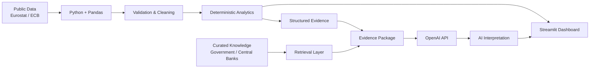

# International Property Market Intelligence

An AI-powered prototype for comparing international residential property markets using official market data, deterministic analytics, and grounded AI interpretation.

The application is designed as a **market-screening and research tool** for analysts and cross-border property investors.

## Overview

Traditional dashboards are effective at showing what has happened in a market, but investors still need to interpret those indicators and understand how they relate to a particular decision.

This prototype combines:

- Official property-market data
- Macroeconomic indicators
- Deterministic Python calculations
- Curated market and regulatory knowledge
- AI-powered natural-language analysis
- Interactive Streamlit visualisation

The objective is not to allow an LLM to calculate or invent market statistics.

Instead, the application creates a controlled evidence package from validated data and asks the AI layer to interpret that evidence.

## Architecture

## Architecture

Current Markets
The prototype currently compares:
- Ireland
- Spain
The architecture is designed so additional markets can be added later.
Indicators
The analytical model currently includes:
Property
- House Price Index
- Year-on-year house-price growth
- Rent Index
- Year-on-year rental growth
Macroeconomic
- Inflation
- Unemployment
- GDP growth
Financing
- ECB policy-rate context
Calculated Indicators
Price / Rent Divergence
House Price YoY Growth - Rent YoY Growth

This indicates whether property prices or rents are currently growing faster.
Real House Price Growth
House Price YoY Growth - Inflation

This provides a simple approximation of house-price growth after accounting for inflation.
AI Market Analyst
The application includes an AI analysis layer that allows users to ask questions such as:
- How do Ireland and Spain compare?
- What are the main risks in the Irish market?
- Where are rents growing faster than property prices?
- Which market currently shows stronger property momentum?
- What additional information should an investor investigate?
The AI receives a controlled evidence package containing the selected market observations and calculated indicators.
It is instructed not to invent missing statistics or produce unsupported forecasts.
Grounding and Knowledge
The application separates three types of information:
1. Source Facts
Numerical observations obtained from authoritative external sources.
2. Calculated Indicators
Metrics calculated deterministically using Python rather than by the language model.
3. AI Interpretation
Natural-language interpretation generated from the supplied evidence.
The prototype also contains a lightweight retrieval layer for curated contextual information relating to housing supply, regulation and market structure.
Because the current knowledge base is small, retrieval is deterministic and country-based rather than using a vector database.
Data Sources
Primary sources currently include:
- Eurostat
- European Central Bank
- Central Bank of Ireland
- Government of Ireland
- Banco de España
- Spain's Boletín Oficial del Estado
The application caches processed data locally for reproducibility and to reduce dependency on external APIs during demonstrations.
Technology
- Python
- Pandas
- Streamlit
- OpenAI API
- Eurostat API
- Jupyter Notebook

Project Structure
property-market-intelligence/
|
|-- app.py
|-- ai.py
|-- data_exploration.ipynb
|
|-- data/
|   |-- market_data.csv
|   `-- data_sources.csv
|
|-- knowledge/
|   |-- ireland_housing.txt
|   |-- spain_housing.txt
|   `-- methodology.txt
|
|-- .gitignore
`-- README.md

Running Locally

Clone the repository:
git clone https://github.com/john0017/property-market-intelligence.git
cd property-market-intelligence

Create a virtual environment:
python3 -m venv .venv
source .venv/bin/activate

Install the required packages:
pip install pandas streamlit openai python-dotenv requests jupyter ipykernel

Create a .env file in the project root:
OPENAI_API_KEY=your_openai_api_key

The .env file is excluded from Git and should never be committed.
Run the application:
streamlit run app.py

Design Principles
The prototype follows several principles:
Deterministic before generative
Numerical calculations are performed in Python. The language model interprets results rather than calculating core metrics.
Evidence before interpretation
The AI receives explicit market evidence and contextual knowledge before answering questions.
Transparency
Users can inspect the underlying market indicators and supporting evidence.
Graceful uncertainty
Where evidence is insufficient, the AI is instructed to identify the information gap rather than fabricate an answer.
Current Limitations
This is a prototype rather than a production investment platform.
Current limitations include:
- National-level rather than property-level analysis
- Limited number of markets
- Limited contextual knowledge base
- No property-price forecasting
- No automated production data pipeline
- No user authentication or role-based access
- No property-level valuation model
The tool should therefore be treated as a market-screening and research aid, not investment advice.
Potential Production Development
A production implementation could introduce:
- Automated data ingestion and refresh
- Additional countries and regional datasets
- Property-level datasets
- Semantic retrieval / vector search
- Structured AI outputs
- Model evaluation and monitoring
- Authentication and role-based access
- Azure OpenAI
- Microsoft Fabric or SQL-based analytical storage
- Automated source provenance and citation tracking

Status
Prototype under active development.